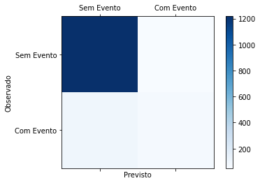

# My Machine learning notes

This page will show my notes on machine learning as well as some notebooks

## ML basics

For information on XGBoost click [here](xgboost.md) 

This is a [link](https://github.com/mteix) to my homepage

## Imbalanced Datasets 

Dados não balanceados aparecem muitas vezes em ML e um caso muito comum é para a detecção de _spam_. Entre todos os _N_ eventos que são as mensagens que chegam a uma caixa postal, apenas alguns poucos (espera-se!!!) sejam _spam_. Assim uma tentativa de treinar um algoritmo de classificação seria enviesada para os resultados não _spam_ (NS) por serem muito mais frequentes que os _spam_ (S). Em outras palavras, em uma matrix de confusão, a ocorrência de verdadeiros positivos para o caso NS seria significativamente maior que a dos casos (S). Entretanto os falsos positivos e falsos negativos desta última fatalmente eclipsariam a classificação como se pode ver na figura e tabela abaixo.

Este modelo tem uma acurácia que chega perto dos 90% e 

|    | NS   | S  |
|----|------|----|
| NS | 1217 | 49 |
| S  | 94   | 65 |

[Nesta página](unbalanced.md) explicamos algumas técnicas para tratar dados não balanceados. 

## Feature Engineering (TODO)
