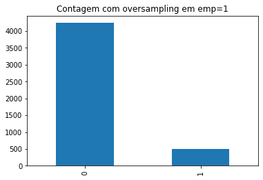

# Dados não-balanceados 

É muito comum que se tenham dados não balanceados. Isso acontece principalmente quando existem dados que 

Vejamos o exemplo abaixo com dados de poluição do ar:

### Poluição do ar em São Paulo - Eventos tipo 0 e tipo 1

Se tentarmos ajustar qualquer modelo de _machine learning_ vamos observar que os resultados não serão satisfatórios. A razão disso que o sistema consegue facilmente dectar os eventos que ocorrem mais (tipo 0) que os do tipo 1. Este é o mesmo problema que se observa quando da detecção de e-mails _spam_ pois estes são uma pequena parcela dos eventos registrados.

Este problema pode ser resolvido usando-se a biblioteca [imblearn](https://imbalanced-learn.org/stable/index.html) do Python. Vamos estudar a seguir algumas técnicas para balancear os dados. 

## *Oversampling*

## *Undersampling*